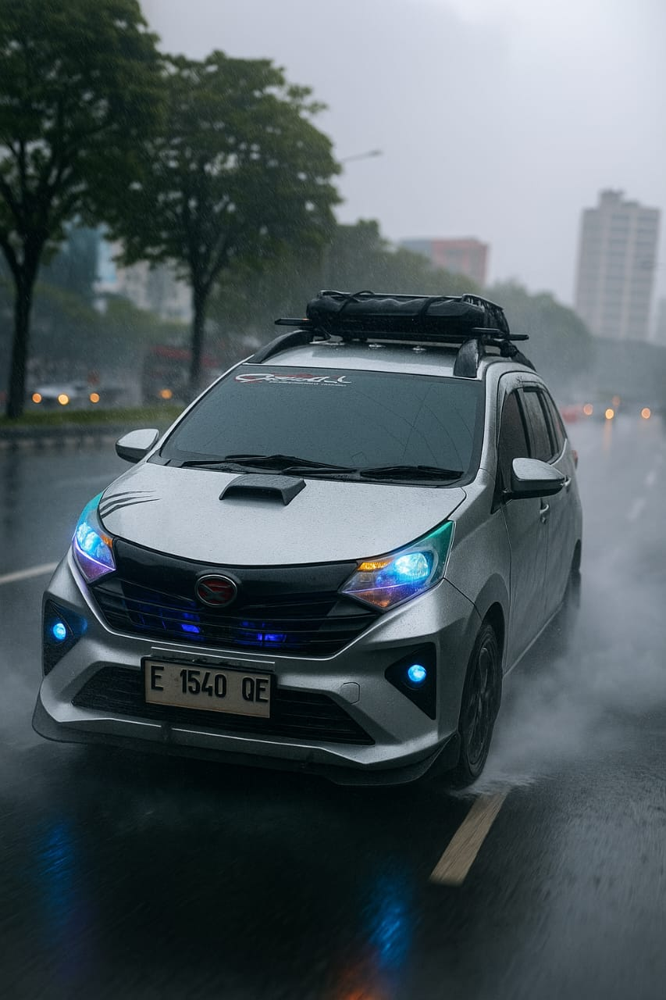
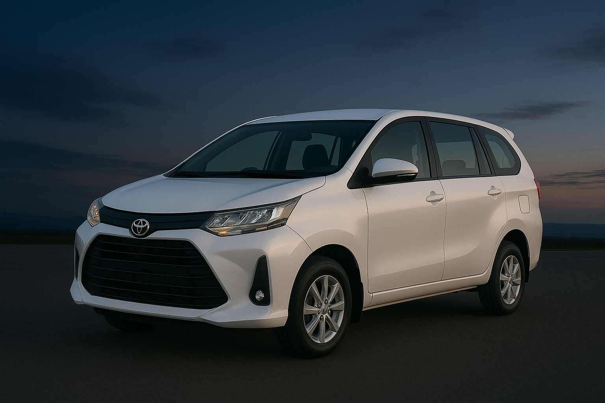
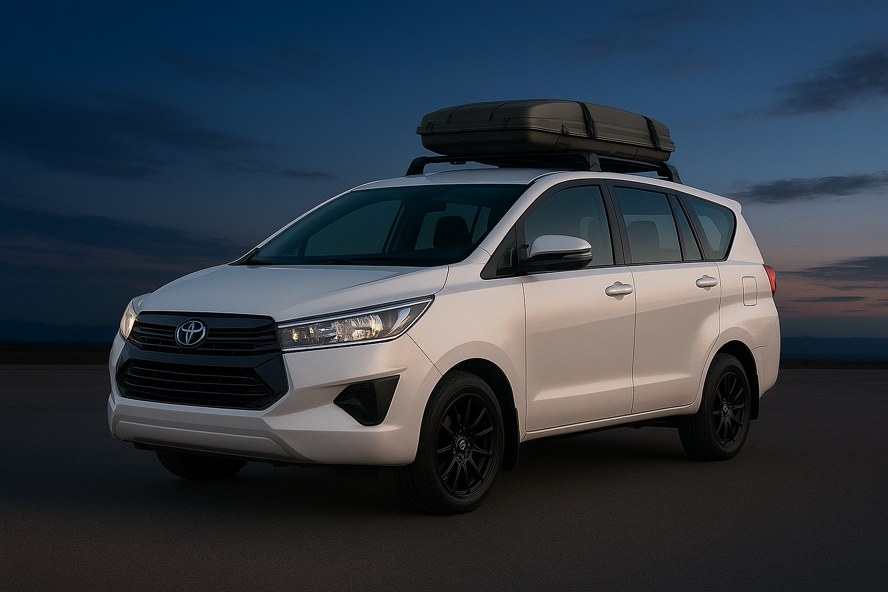
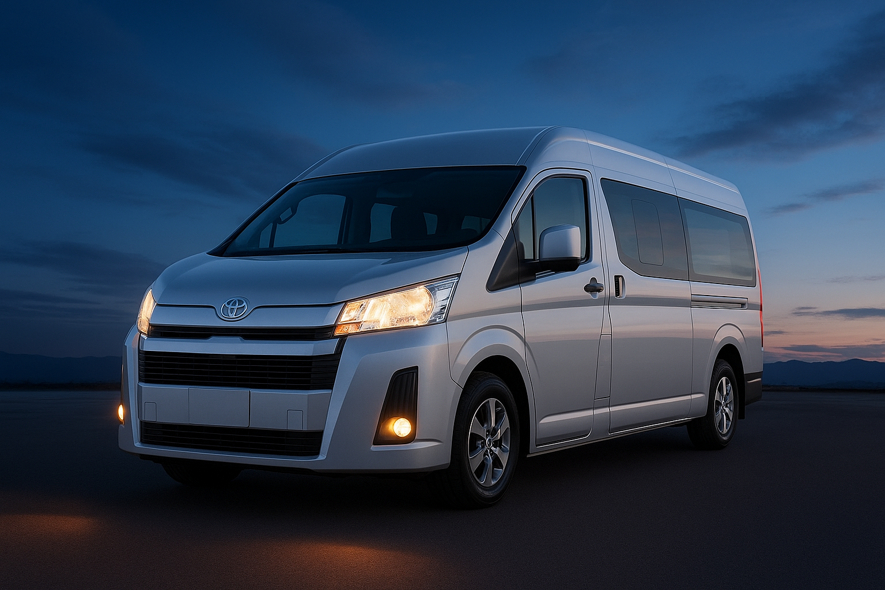

<!DOCTYPE html>
<html lang="id">
<head>
  <meta charset="UTF-8">
  <meta name="viewport" content="width=device-width, initial-scale=1.0">

  <!-- Judul web (muncul di tab browser & Google) -->
  <title>Travel Indramayu - Subang - Jabodetabek | Sbg Santri Babadan Group</title>

  <!-- Deskripsi singkat (muncul di Google Search) -->
  <meta name="description" content="Layanan travel door to door dari Indramayu - Subang - Karawang - Jabodetabek. Bisa antar jemput bandara & wisata. Hubungi via WhatsApp untuk info & pemesanan.">

  <!-- Kata kunci biar mudah dicari -->
  <meta name="keywords" content="travel indramayu, travel subang, travel karawang, travel jabodetabek, door to door travel, sbg santri babadan group">

  <!-- CSS kamu tetap di sini -->
  
</head>
<body>
  <!-- isi website -->
</body>
</html>
  <head>
  
</head>
  <meta charset="UTF-8">
  <meta name="viewport" content="width=device-width, initial-scale=1.0">
  <title>SBG Transport</title>
  
</head>
<body>

<header>
  <h1>SBG Transport</h1>
  
Santri Babadan Group • Layanan Transportasi Door to Door

</header>

<section class="hero">
  <h2>Selamat Datang di SBG Transport</h2>
  
Rute: Indramayu – Subang – Karawang – Jabodetabek & sebaliknya

  <a href="https://wa.me/6283850259833" class="cta-button">Pesan Sekarang via WhatsApp</a>
</section>

<section>
  <h2>Sejarah Kami</h2>
  
SBG Transport berdiri dari komunitas santri Babadan, berawal dari usaha kecil untuk membantu mobilitas warga. Kini berkembang menjadi layanan transportasi profesional dengan rute Indramayu, Subang, Karawang hingga Jabodetabek. Fokus kami adalah memberikan layanan door to door yang aman, nyaman, dan tepat waktu.

</section>

<section>
  <h2>Layanan Kami</h2>
  

    
<h3>🚖 Door to Door</h3>
Antar jemput langsung dari rumah ke tujuan.

    
<h3>✈️ Bandara</h3>
Antar jemput Soekarno Hatta & Halim.

    
<h3>🚉 Stasiun</h3>
Penjemputan Stasiun Gambir, Bekasi, dll.

    
<h3>🏖 Wisata</h3>
Transportasi ke destinasi wisata favorit.

    
<h3>🏢 Acara & Perusahaan</h3>
Solusi transportasi event & corporate.

    
<h3>📦 antar Paket & document 24 jam </h3>
Solusi antar paket cepat.

  

</section>

<section>
  <h2>Pilihan Mobil</h2>
  

    
<h4>cayla /sigra </h4>

    
<h4>Avanza / Xenia</h4>

    
<h4>Innova</h4>

    
<h4>Hiace / Elf</h4>

  

</section>

<section>
  <h2>Rute Utama</h2>
  <table>
    <tr><th>Dari</th><th>Ke</th></tr>
    <tr><td>Indramayu</td><td>Subang</td></tr>
    <tr><td>Subang</td><td>Karawang</td></tr>
    <tr><td>Karawang</td><td>Jabodetabek</td></tr>
    <tr><td>Jabodetabek</td><td>Indramayu</td></tr>
  </table>
</section>

<section>
  <h2>Formulir Pemesanan</h2>
  

    <form action="https://wa.me/6283850259833" method="get" target="_blank">
      <input type="text" name="nama" placeholder="Nama Lengkap" required>
      <input type="text" name="penjemputan" placeholder="Lokasi Penjemputan" required>
      <input type="text" name="tujuan" placeholder="Tujuan Perjalanan" required>
      <textarea name="catatan" placeholder="Catatan (opsional)"></textarea>
      <button type="submit">Kirim ke WhatsApp</button>
    </form>
  

</section>

<footer>
  
Kontak: 083850259833 | 
      Email: massbrayen@gmail.com

  
&copy; 2025 SBG Transport. Semua Hak Dilindungi.

</footer>

<a href="https://wa.me/6283850259833" class="whatsapp-float">💬</a>

</body>
</html>
